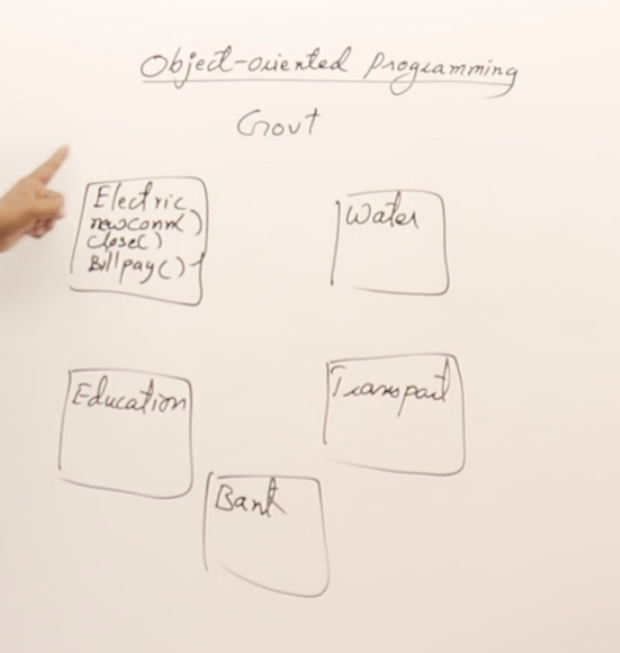

## Introduction to OOPS:

**Modular Programming**

This is a procedure paradigm, everything was small scale applications that did specific tasks

Bank example:

Modular Programming approach will look at this program in a different way than OOP:

actions may include :

Functions: in this paradiam will just be sets of modules that will complete these tasks

* openAcc()
* deposit()
* withdraw()
* checkbal()
* applyload()

**Object Orientated Programming**

Government Example: The government supplies lots of public services... because of multiple components in the system scalling was needed and this paradigm took a dominant hold because of the complexities readily available for larger more common place machine computation tasks

These can be defined in this way.



Each of these objects will have its own relative functions that will operate in the Government system.

compared to the Bank example the Government is much easier becuase each object has its own modules and not one massive amount of code base.


### Main Principles of Object-Orientation

There are two main elements of Programming, and are needed to make software

* Data: objects items which are often numerical

* Functions: which manipulate that data


1. *Abstraction:* client side applications should focus on simple UI and other needs, like a car the user doesn't need to know how it works, they just need to turn a key and press the gas or brakes. The user doesn't need to know how things work. Dont need to see implementation of the Functions just the functions inside of a class, 

2. *Encapsulation:* this technique keeps items safe from miss, not for security, making data private and functions as Public.

3. *Inheritance:* from the car example in heritance is the way program's class methods can be passed onto sub classes and child classes

4. *Polymorphism*: Similar to the Car example. when you learn to drive you dont learn a how to drive a specific model vehicle you learn how the drive a car. there are little differences when you make a class it will have different sub classes and adaptations to the main behavior or the root class but still have the same functionality of that class. Just a reuse of a class.

**Class vs Objects**

Classes are defintions and objects are instances of that class

*Classes* are basically blueprints of the *objects* to follow particular formats

Examples:

>
>Class Human -> You / Me 
> We are Humans But you and me are objects of the class human
>
>Class Car -> Toyota / Honda
>Cars are classes but there are instances of cars
>

Creates a basic class

```cpp
class Rectangle 
{
    float length;
    float breadth;

    // Functions:
    float Area()
    float perimeter()
    float diagonal()
}

int main() 
{
    // Creates Classes
    Rectangle r1, r2;
}
```

**Constructors in C++**

There are four different types of constructors in C++, most of them are just overloaded methods for creating classes

1. Default Constructor (Compiler Provided)
2. Non-Parameterized (Default Constructor)
3. Parameterized
4. Copy Constructors

Constuctors are the same name as the class name.

**Non-Parameterized (Default Constructor)**
default values are added to the class istantiation of the class.

```c++
Rectangle () {
    // Default values for Rectangle
    length = 0;
    width = 0;
}
```

**Parameterized Constructor**

adds attributes to the class on istantiation or the creation of the object.

```c++
Rectangle (int l, int w) {
    // Default values for Rectangle
    setLength(l);
    setWidth(b);
}
```

**Copy Constructors** 

are classes that are specific to a certain class with its object atttributes combined to replicate a new version of the same class istantation. They are not created from new values theya are passed by reference to another rectangle on heap. The compiler provides all of the attributes of the classes that are being passed.

```c++
Rectangle (Rectangle( &rect) {
    // Default values for Rectangle
    length = rect.length();
    width = rect.width();
}
```
```c++
Rectangle (int l = 0, int w = 0) {
    // Default values for Rectangle
    setLength(l);
    setWidth(w);
}
```

**Functions in Classes**

Functions for Classes are found in the *public* section of the class definition.
With All of these functions written you have created (wether you need them or not) a PERFECT class in C++.

1. Constructors
2. Mutators (Setters)
3. Accessors (Getters)
4. Facilitator Functions
5. Inspector Functions
6. Destructor Functions

Here is an Example of the complete Rectangle Class definition that was used in all of the course's sections:

```c++
class Rectangle 
{
    private: 
        int length;
        int width;
    public:
        // CONSTRUCTORS:
        // Default Constructor:
        Rectangle();
        Rectangle(int l, int w);
        // Deep Copy Constructor
        Rectangle(Rectangle &r);

        // MUTATORS
        void setLength(int l);
        void setWidth(int w);
        
        // ACCESSORS
        int getLength();
        int getWidth();

        // FACILITATOR:
        int area();
        int perimeter();
        
        // INSPECTORS:
        int isSquare();

        // DESTRUCTOR:
        ~Rectangle();
}
```


