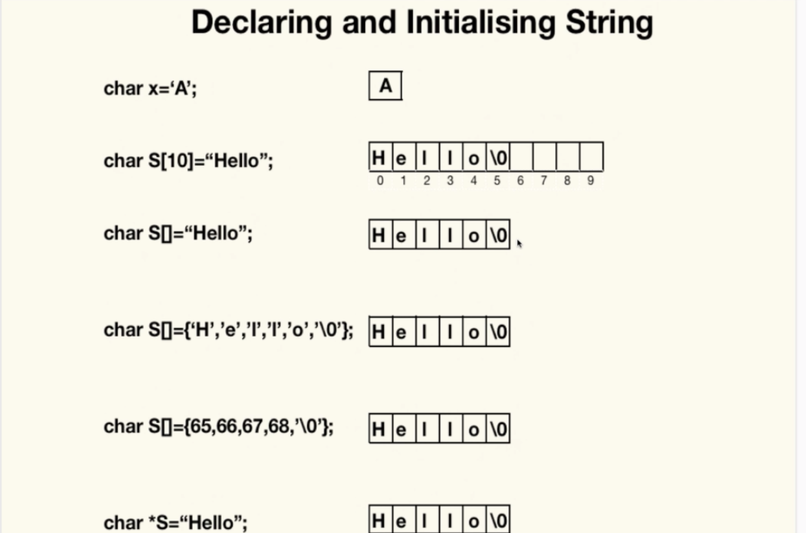

## C++ Strings

in C++ there are two methods like any other programming language for representing strings.

1. Using Char Arrays 
2. Class String

Declaring and Initializing a String

**String Functions**

String Length: displays the length of the string 

`strlen(<string>);`