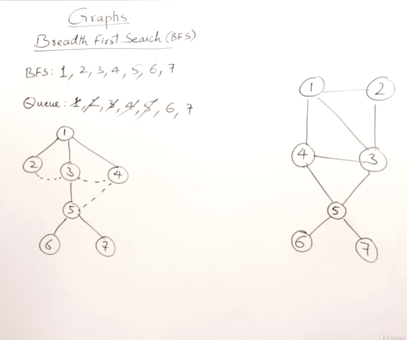
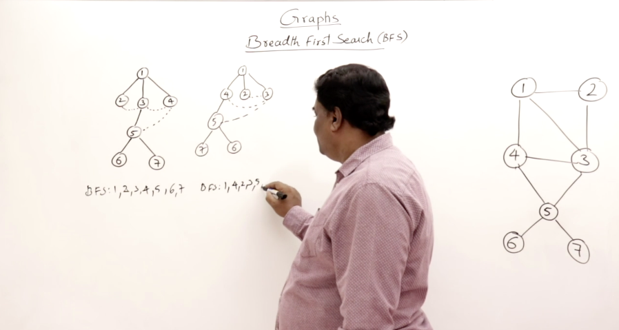

## Breadth First Search

*BFS* or Breath first search means that you can travel from an starting vertex you desire and create an exploration of each vertex you visit. While exploring you can visit additional neighboring Verticies in any order to define a tree definition of the graph.

**Formal Definitions**

* Visiting- Starting points for searching. Held values into a queue.

* Exploring- visiting additional verticies that are attached to a vertex. Dequeued values after exloring.

Queue Structures are the technical language way of doing this exploration process from a programmign language. Order doesn't matter as long as all nodes are vistied a BFS Spanning Tree can be produced.

Time Complexity: Work to be done depends on the number of Verticies that need to be visited on the graph. N verticies are being visited and the time for this operation is Order of N. 

Analytically you MUST ignore insertions and deletions from the queue process as part of the complexity.

Below is an example implementation of the Queue Structure method for BFS implementation.
The Resulting Tree is known as a BFS-spanning Tree. The edges are called *Cross Edges*

