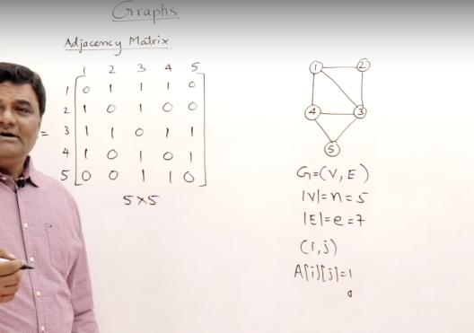
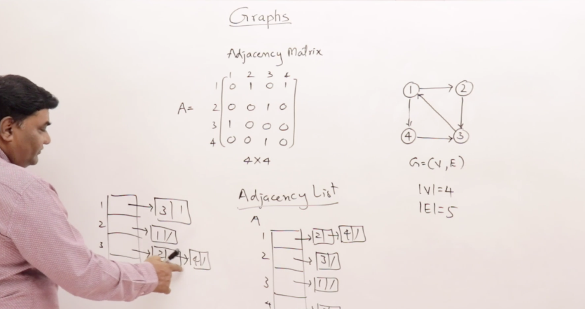
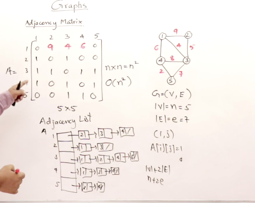
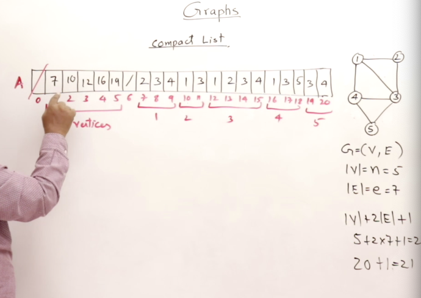

## Data Structures For Graphs

**Adjacency Matrix**

Points in which the edges exist between Verticies there is a denoted value of 1 *degrees* can be calculated from the number of 1s in the entry for that vertex.

Time Complexity for Accessing the Adjacency Matrix is `O(n^2)`

**Adjacency List** 

Linked list used to represent each location as a Node in the Linked List

Time Complexity for accessing the Elements in the List is analized on the basis of V + E 

**Weighted Graphs**

Stored in the form of adjacency Matrix with the degree's weight of each edges. This adjustment forms a cost adjacency matrix.

**Compact List Representation**

A Small Calculation is done to represent the elements in the List for the size of the array.

Time Complexity for Compact Lists is Linear because the elements are not needing to be checked multiple times and the constants of both N and E are not quadratic in nature `O(N)`
