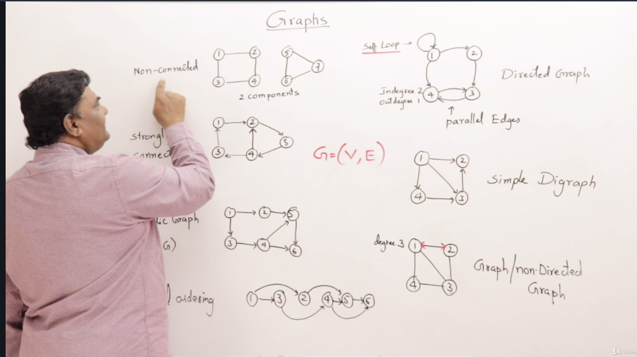

## Graphs

Graphs are defined as a length of connected verticies and edges. often writen as 

`G = (V, E)` : Where V is a set of verticies and E is a set of edges.

Graphs are very useful breaking down complex programing problems and assist in forming solutions to these proble,s. a solid undertstanding in conceptual design and implimentation can make you a better programmer/problem solver.

Below are examples of graphs

**Components for Graphs**

*Paths* are defined as a set of verticies which connect a pair of verticies.

*Cycles* are defined as circuit running from a starting point of a single vertex and then returning to that same vertex. such as the example in the image above of the Strongly non-connected graph starting at position `1 -> 2 -> 4 -> 3 -> 1`

**Directed Graphs**

There are many types of Graphs if the Graph has arrows it is considered a directed graph. If the Graph Loops back to itself it is known as a *Self-Loop*. If two points are connected with each other they are known as a *Parallel Edge*. The number of connections going to a node/verticies point in a path is known as its *Indegree number*. THe number of edged leaving a node/vertices point is known as its *out-degree*.

If the graph allows for traversal among all nodes it is considered a *strongly connected* graph see image attached

**Directed Acyclic Graph**

Selected a starting vertex and there are no cycles. This means that the paths of all verticies can be arranged in a linear path such as the last image on the left hand side of in the example. If the edges can be arranged in such a way then it is known as a *topological ordering*. which is only possible in DAG graphs

**Simple Digraph**

Graphs without:

* Self-loops
* parallel edges

are considered Simple Digraphs.

**Graph / Non-Directed Graphs**

Undirected no arrows. in an non-directed graph. the number of edges connected to a vertice are known as *degrees*. the directions of the edges are assumed to allow for two way travel.

**Non-Connected Graphs** 

Are connected with two components via an *articulation point*. if another point is connected to the two components they are then considered strongly connected and thus a single component.

