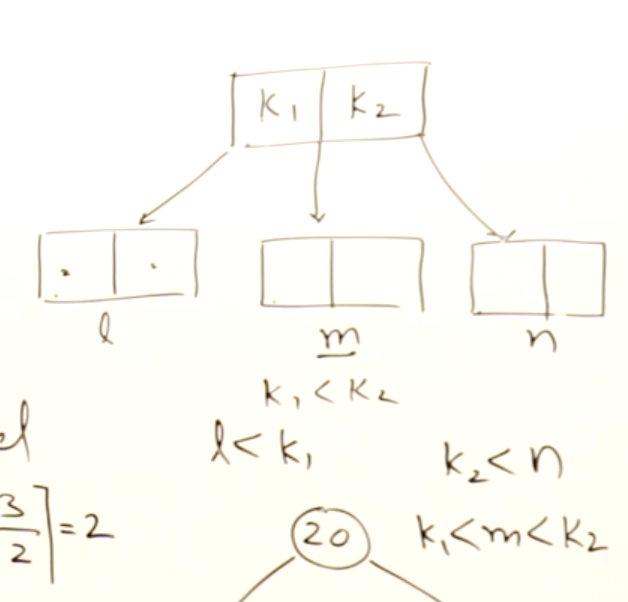

## 2 3 Trees

Search Trees, in Binary Search Trees there are known as *M-way Search Trees*. 2 3 Search Trees are Search Trees with Degree 3. They are Height Balanced B-Trees.

**Rules for Children**

Every Node must have `mathCeil(n/2)` Children
and All Leaf Nodes are at the same level, Left Child, Middle Child, Right Child. Cannot have duplicates

**Key Arrangement**

Unlike Binary Search Trees, 2 3 Trees grow upwards.

**Insertion Example**

