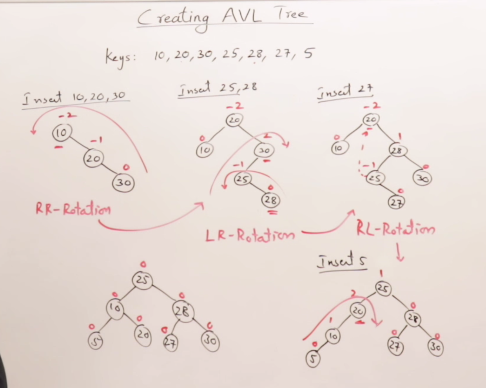
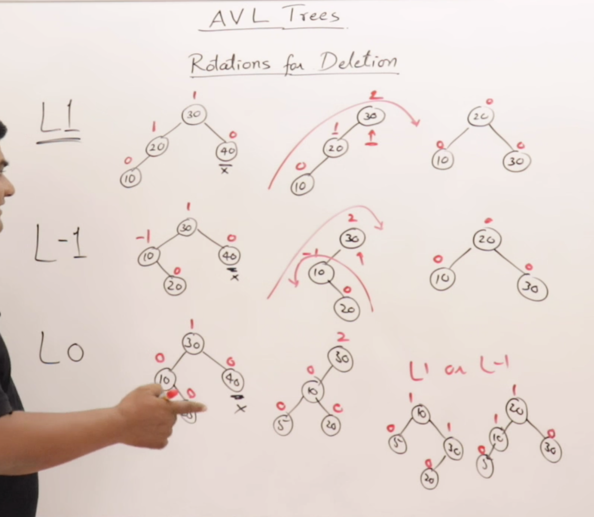

## AVL Trees

Balance Factor = Height of Left Subtree - height or Right subtree 

Calculated from every node. should be {-1,0,1}

Balance Factor should be 

`bf = |hl - hr| <= 1`    

If Balance Factor is GREATER than 1 it is imbalanced, And Balancing must be done.

**Calculate Balance Factors**

 Practice Elements from the Video and labs in order to practice balancing the trees

 Balancing Trees is done through rotations at the time of insertions

 **Rotating AVL Trees**

Technique for Balancing the Trees Throught Right Rotation or Left Rotation to Balance the Trees Image like a thread is being held onto the whole chain and you are pulling in in a certain direction.

Rotations are always done through *Three* Nodes

Types of Rotation

* LL Rotation
* RR Rotation

Double Rotations

* LR Imbalance Rotation
* RL Imbalance Rotation

**Formula of Rotation for Insertion**

**Creating an AVL Tree**

By reordering the tree after each insertion it will reduce the height of the trees and thus reduce the amount of needed comparisons for the search of the tree.

**Rotation for Deletion**

After Deleting a node the inorder predosessor of the tree

The Rotation techniques are the same but named differently due to the nodes which will take the place of the root.

**Height vs Nodes in AVL Trees**

If Height is given find 

min Nodes `n = N(h-2)+N(h-1)+1 `
max Nodes `n = 2^(h+1) -1`

If 'N' Nodes are given find

min Height h = `logbase2(n+1)`
max Height h = ``