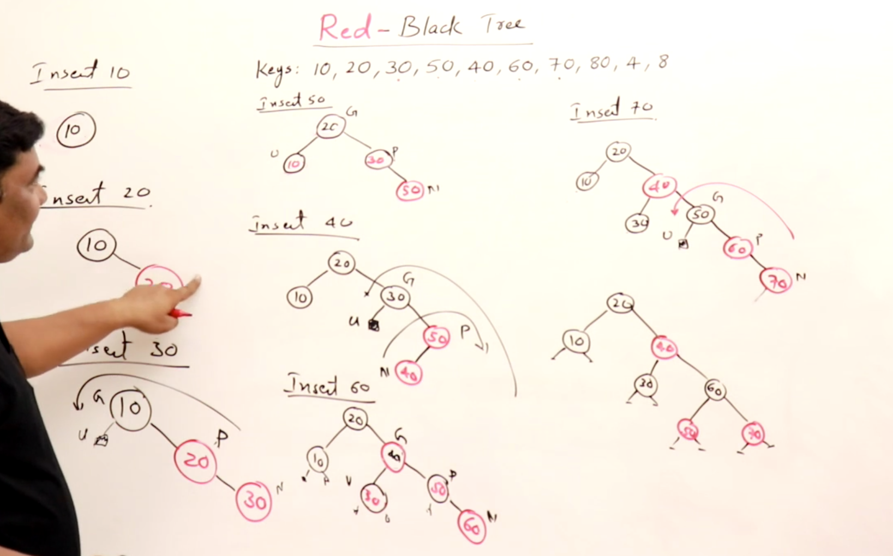

## Red Black Trees

Height balanced binary search Tree, similar to 2-3-4 tree. Every Node is either Red or Black
Root of the tree is Black. Very Similar to 2-3-4 Trees, Nodes are either Red or Black. **NULL** Values are also Black

Number of Blacks on paths from root to leaf are the same.

No **TWO** Consecutive Reds, Parent and Children of Red have to be **BLACK**.

New Inserted Node is **RED**

Height is LogN <= h <= 2 Logn

**Tree Creation Process**

**Similarities to 234 Trees**

Red Nodes are Combined into a single node of relation

**Node Deletion**

Normally There is not a problem with deletion in Node Values in the Tree if the values Deleted are RED colored.

Id the values in a Red Black Tree are Black then there will be multiple issues that must be averted because the balanced elements of RED BLACK Trees are dependent on the number of Blacks Height in the Tree.

**Cases for Black Node Deletion**

* Case1: If the Node you are deleting is a leaf node and the leaf node is black then delete the node and create a *Double Black*